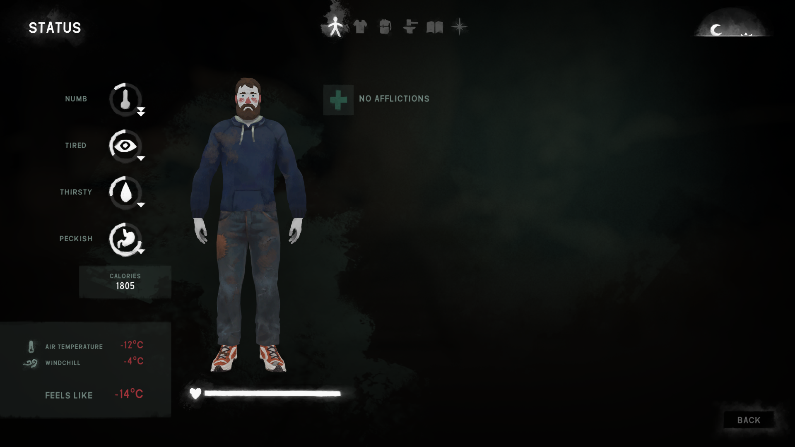

# EnableStatusBarPercentages

This mod re-enables some labels in the **status / first aid screen** that show a percentage value of how full the warmth, fatigue, thirst, hunger, and health status bars are.

These labels were hidden, but fortunately not removed, during the last few UI updates.

## Installation

1. If you haven't done so already, install the [Mod Loader](https://github.com/zeobviouslyfakeacc/ModLoaderInstaller)
2. Install the mod automatically by using [WulfMarius's Mod-Installer](https://github.com/WulfMarius/Mod-Installer/releases)

or

1. If you haven't done so already, install the [Mod Loader](https://github.com/zeobviouslyfakeacc/ModLoaderInstaller)
2. Download the latest version of `EnableStatusBarPercentages.dll` from the [releases page](https://github.com/zeobviouslyfakeacc/EnableStatusBarPercentages/releases)
3. Move `EnableStatusBarPercentages.dll` into the mods folder in your TLD install directory

## Screenshots

Before, without *EnableStatusBarPercentages*:

After, with *EnableStatusBarPercentages*:

